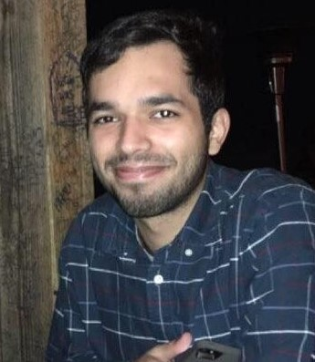

#
#
#
#

#
#
#
#### ***You can call me Sal!***
#
#
#####  I'm an aspiring public health professional and researcher currently pursuing a Master of Public Health in Epidemiology from Columbia University. My interests lie in epigenetics, the microbiome, and the intersection between climate change and infectious diseases.

